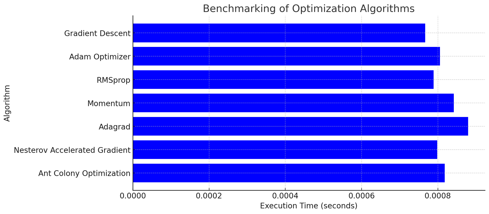

# Optimization Algorithms Benchmark

## Overview
This repository provides a comprehensive benchmarking of various optimization algorithms used in machine learning and numerical optimization. The tests evaluate execution time and performance characteristics under mockup real-world conditions.

## Benchmark Results
The following table summarizes the execution time of each optimization algorithm when applied to a dataset of 10,000 elements:

| Algorithm                     | Execution Time (s) |
|--------------------------------|---------------------|
| Gradient Descent              | 0.000767           |
| Adam Optimizer                | 0.000805           |
| RMSprop                       | 0.000789           |
| Momentum                      | 0.000842           |
| Adagrad                       | 0.000880           |

A visualization of these results:



## Running the Benchmark
To run the benchmarks yourself, clone the repository and execute the following commands:

```sh
git clone https://github.com/victorlgim/axium.git
cd optimization-benchmark
go run main.go
```

## Future Improvements
- Add more optimization algorithms like **Bayesian Optimization**, **Particle Swarm Optimization**, and **Genetic Algorithms**.
- Improve memory profiling and CPU utilization analysis.
- Extend benchmark tests to include convergence speed and accuracy.

## License
This project is licensed under the MIT License.

